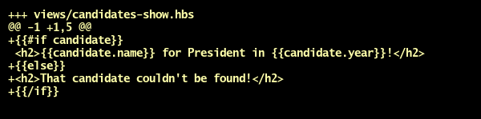

[Back to main](readme.md)

-----

> 10/10

# npm init && npm install --save express

- What is NPM?
- What does `package.json` do?
- What does `--save` do?

# Added index.js

- What does `nodemon` do?
- What does `require` do?
- What's the difference between `require("hello")`, `require("./hello")`, and `require("./hello.js")`?
- Note the `()` at the end of `express()`. This means `require("express")` must be returning what kind of object?
- What does the `.get` in `app.get` indicate?
- What do `req` and `res` stand for?
- What happens if you don't include `res.send`?
- What is `3001`, and how does it affect what you do in your browser?

-----
STOP
-----
> 5/15

# npm install --save express-handlebars

- Whenever you `npm install --save` something, you'll also probably need to do what?
- Before you can `require` something, you'll probably need to do what?

# Added views

- `<%= yield %>` in Rails is like what in Handlebars?
- What's the difference between a `.hbs` file and a `.html` file?

# Configured Handlebars

- What's the difference between `res.send` and `res.render`?

-----
STOP
-----
> 5/20

# Added express.static and CSS

- What do the two arguments in `app.use` in this snippet do?
- Why is `app.use` called "*middle*ware"?
- If I write `app.use("/wombat", express.static("chicken"))`...
  - In which folder should I put all my CSS files?
  - When I `<link>` to my CSS, with what will the `href` path begin?

# Added front-end Javascript

- What's the difference between front-end Javascript and back-end Javascript?

-----
STOP
-----
> 10/30

# Added candidates#index route

- What does the second argument in `res.render` do? What kind of data type should it be?

# Added fake data

- What is `module.exports` and how is it related to `require`?

# Added #each in index

- What's the difference between how you begin an end an `each` loop in Handlebars?
- How is Handlebars' `#each` similar to Ruby's `.each`?

-----
STOP
-----
> 10/40

# Added candidates#show route

# Included data in candidates#show

# Added #if in candidates#show

-----
STOP
-----
> 5/45

# Deploying to Heroku

- What does a Procfile do?
- What's the point of environment variables?
- How do you access environment variables?

-----

[Back to main](readme.md)
