# WhenPresident Walkthrough

# npm init && npm install --save express

- What is NPM?
- What does `package.json` do?
- What does `--save` do?

# Added index.js

# npm install --save express-handlebars

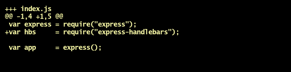

# Added views

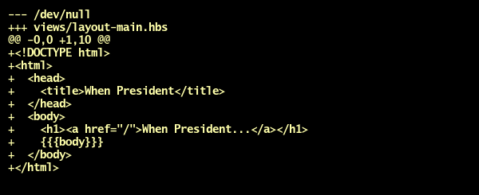

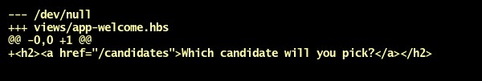

# Configured Handlebars

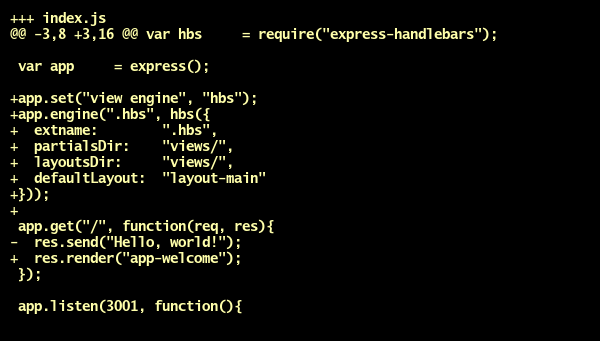

# Added express.static and CSS

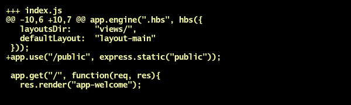

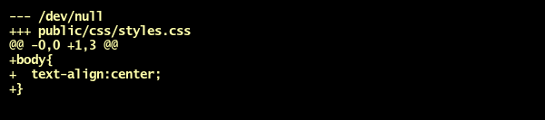

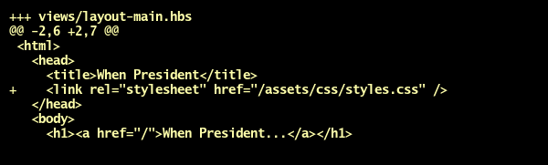

# Added font-end Javascript

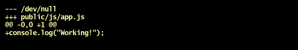

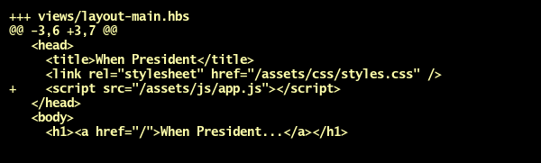

# Added candidates#index route

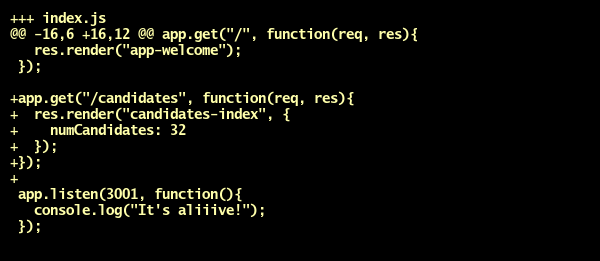

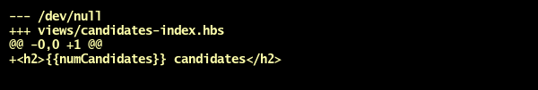

# Added fake data

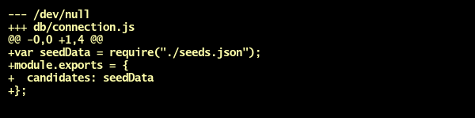

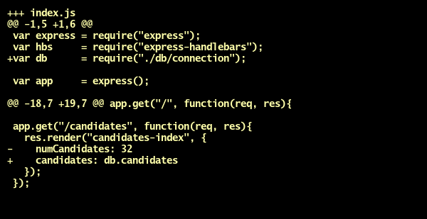

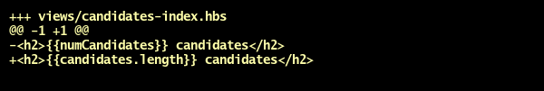

# Added #each in index

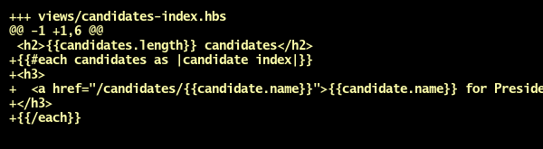

# Added candidates#show route

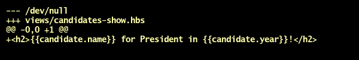

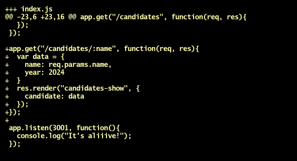

# Included data in candidates#show

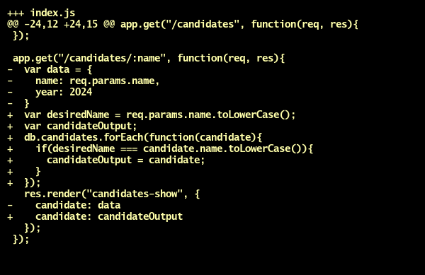

# Added #unless in candidates#show

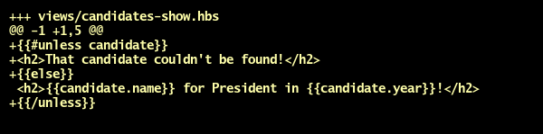

# Deploying to Heroku

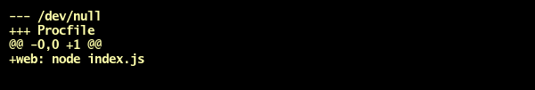

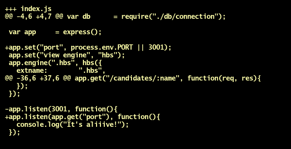

# npm install --save mongoose

# Connected to Mongoose

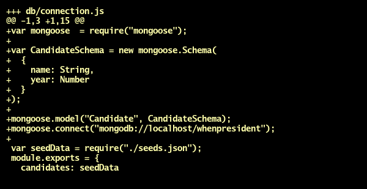

# Added seed data (to database)

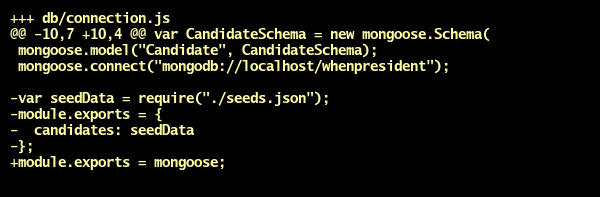

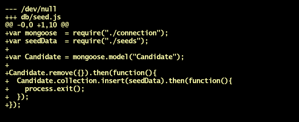

# Shows DB candidates in candidates#index

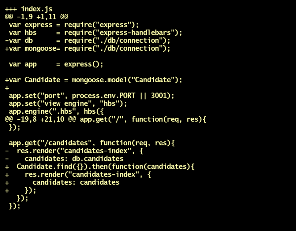

# Shows DB candidates in candidates#show

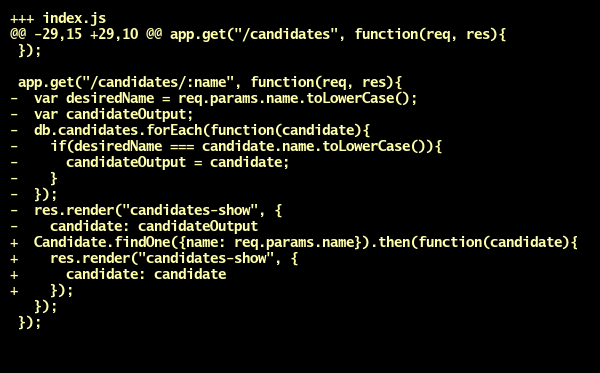

# npm install --save body-parser

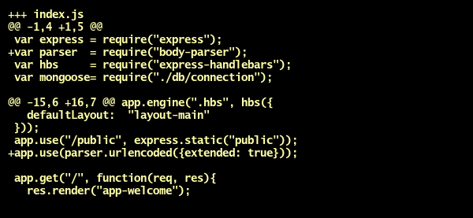

# Added nonfunctional post route

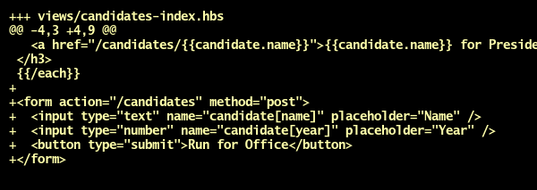

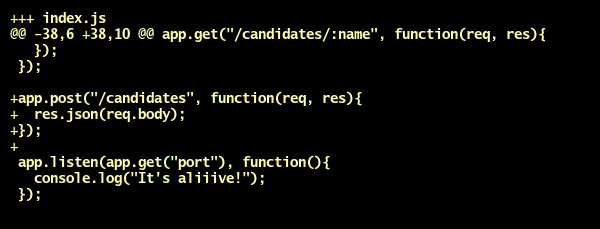

# Saves new candidate to database

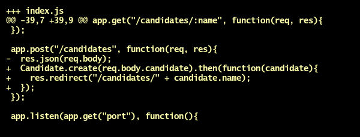

# Updates a candidate in the database

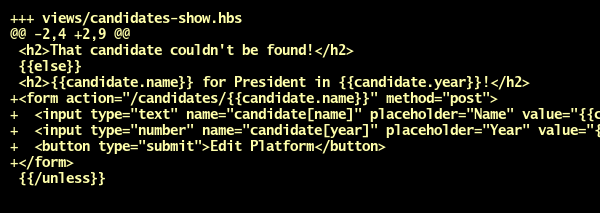

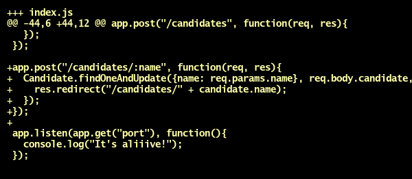

# Deletes candidate from database

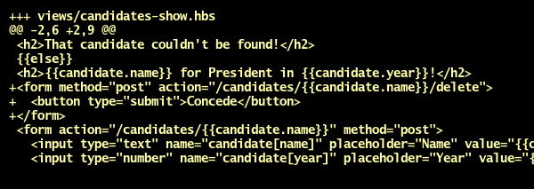

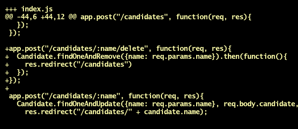

# Added procfile and Mongolab URL for deployment

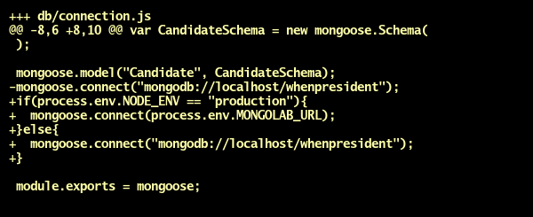

# Added positions to candidate

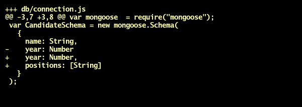

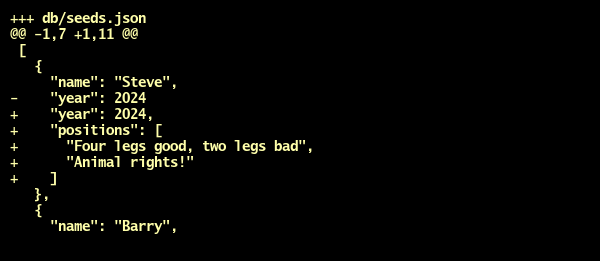

# Can add a position

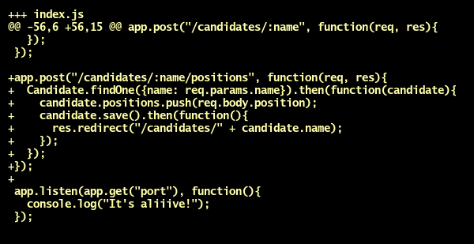

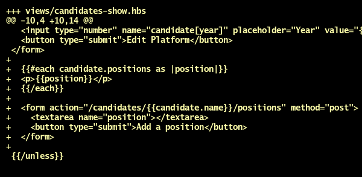

# Can delete a position

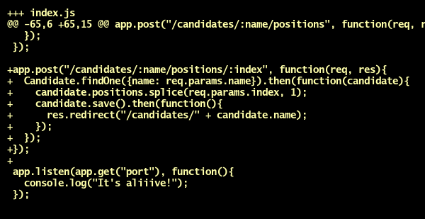

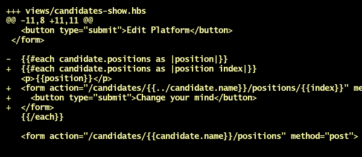
